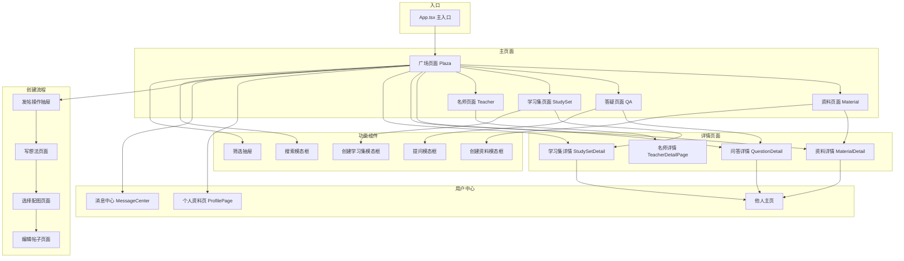
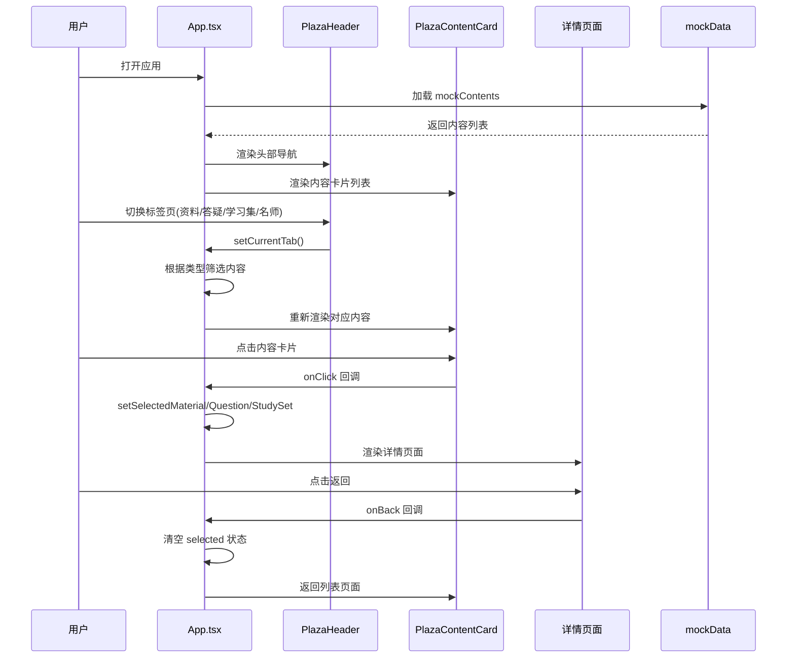
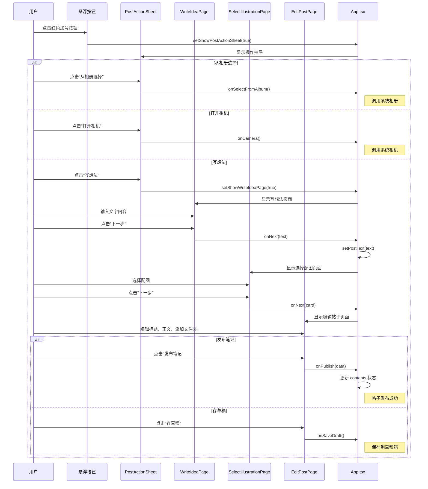
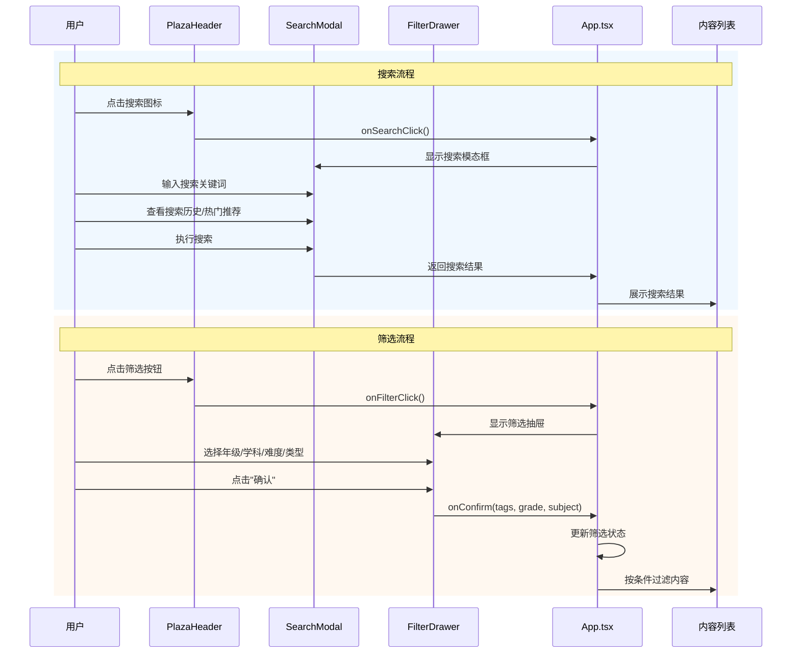
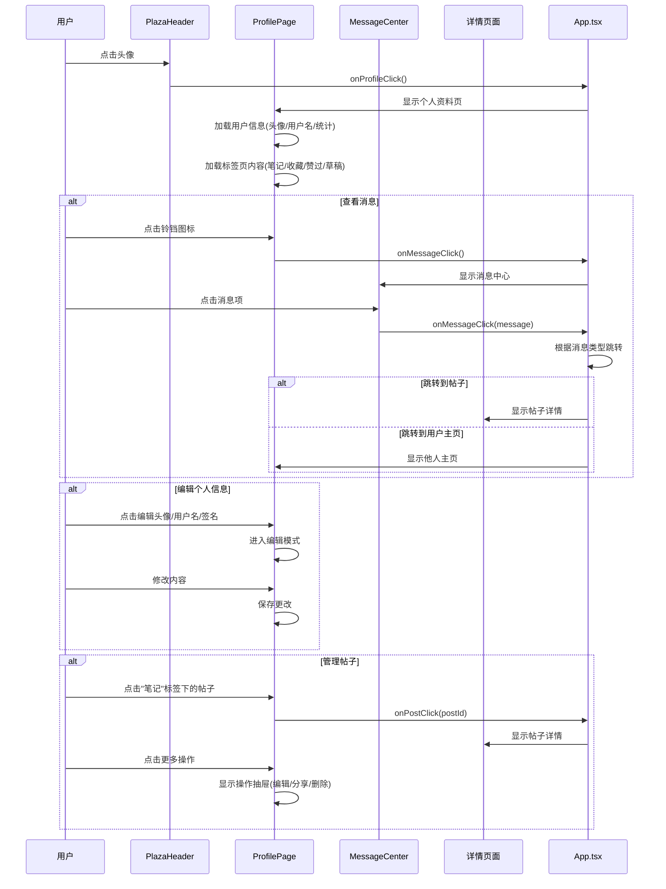
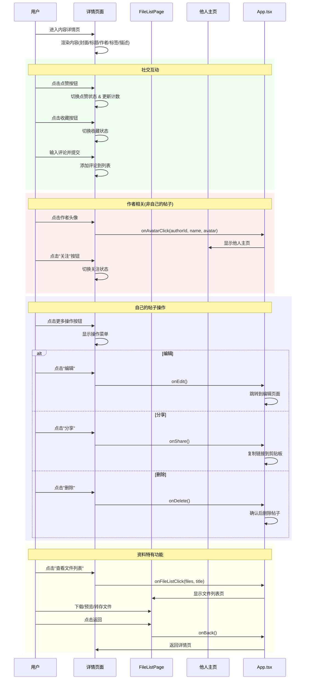
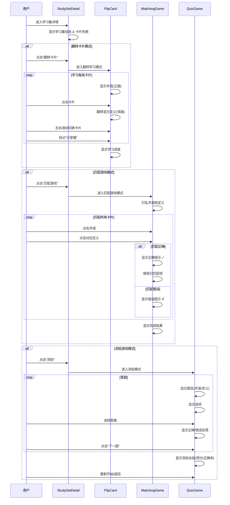
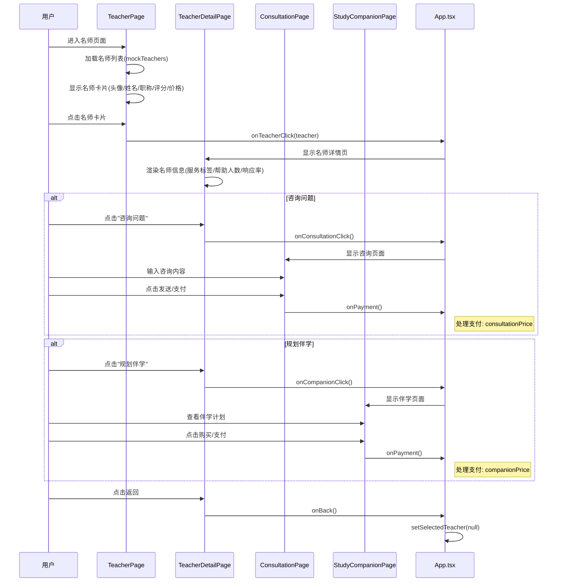
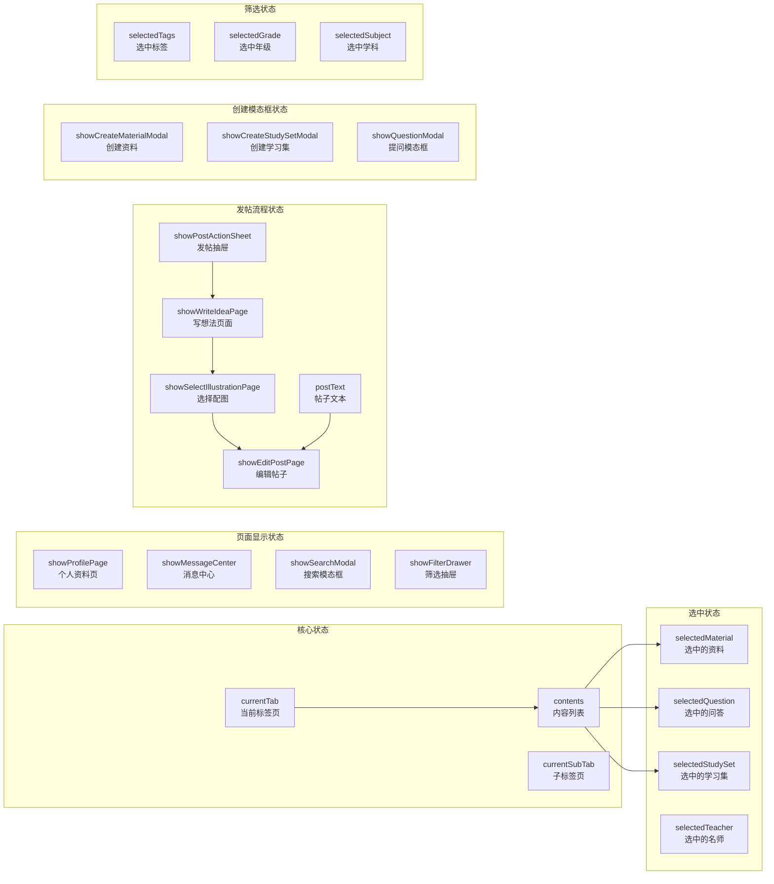

# 家长社区应用 - 时序流程图

## 1. 整体应用架构流程

---

## 2. 用户浏览内容流程

---

## 3. 发帖创建流程

---

## 4. 搜索与筛选流程

---

## 5. 用户中心流程

---

## 6. 内容详情交互流程

---

## 7. 学习集学习流程

---

## 8. 名师咨询流程

---

## 9. 状态管理流程

---

## 10. 组件依赖关系

```mermaid
flowchart TB
    App[App.tsx<br/>主应用入口]
    
    subgraph 数据层
        Mock[mockData.ts<br/>模拟数据]
        Types[types/index.ts<br/>类型定义]
    end
    
    subgraph 页面组件
        Plaza[PlazaHeader<br/>广场头部]
        Material[MaterialPage<br/>资料页面]
        QA[QAPage<br/>答疑页面]
        StudySet[StudySetPage<br/>学习集页面]
        Teacher[TeacherPage<br/>名师页面]
    end
    
    subgraph 详情组件
        MaterialDetail[MaterialDetail]
        QuestionDetail[QuestionDetail]
        StudySetDetail[StudySetDetail]
        TeacherDetail[TeacherDetailPage]
    end
    
    subgraph 用户组件
        Profile[ProfilePage]
        Message[MessageCenter]
    end
    
    subgraph 创建组件
        PostSheet[PostActionSheet]
        WriteIdea[WriteIdeaPage]
        SelectIllust[SelectIllustrationPage]
        EditPost[EditPostPage]
        CreateMaterial[CreateMaterialModal]
        CreateStudySet[CreateStudySetModal]
        QuestionModal[QuestionModal]
    end
    
    subgraph 功能组件
        Search[SearchModal]
        Filter[FilterDrawer]
        FileList[FileListPage]
    end
    
    subgraph 学习组件
        FlipCard[FlipCard]
        MatchGame[MatchingGame]
        QuizGame[QuizGame]
    end
    
    subgraph 卡片组件
        PlazaCard[PlazaContentCard]
        MaterialCard[MaterialCard]
        StudySetCard[StudySetCard]
        QuestionCard[QuestionCard]
        TeacherCard[TeacherConsultationCard]
    end
    
    App --> Mock & Types
    App --> Plaza & Material & QA & StudySet & Teacher
    App --> MaterialDetail & QuestionDetail & StudySetDetail & TeacherDetail
    App --> Profile & Message
    App --> PostSheet --> WriteIdea --> SelectIllust --> EditPost
    App --> CreateMaterial & CreateStudySet & QuestionModal
    App --> Search & Filter & FileList
    
    StudySetDetail --> FlipCard & MatchGame & QuizGame
    
    Plaza --> PlazaCard
    Material --> MaterialCard
    StudySet --> StudySetCard
    QA --> QuestionCard
    Teacher --> TeacherCard
```

---

## 图例说明

| 符号 | 含义 |
|------|------|
| `participant` | 参与者/组件 |
| `-->` / `->>` | 同步调用 |
| `-->>` | 返回/响应 |
| `alt` | 条件分支 |
| `loop` | 循环 |
| `rect` | 分组/区域 |
| `Note` | 注释说明 |

---

## 技术栈

- **前端框架**: React 18 + TypeScript
- **构建工具**: Vite
- **样式方案**: Tailwind CSS
- **图标库**: Lucide React
- **状态管理**: React useState Hooks

